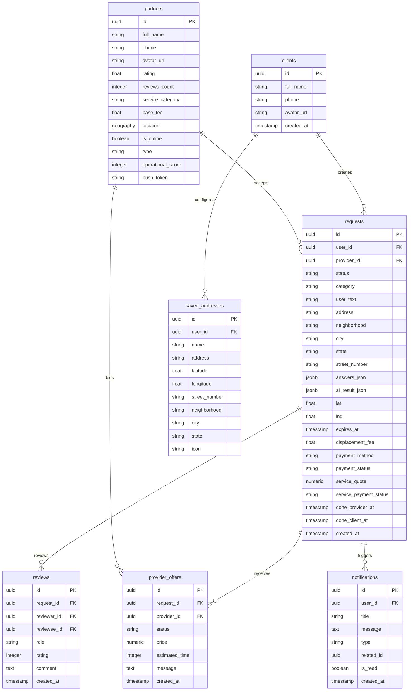
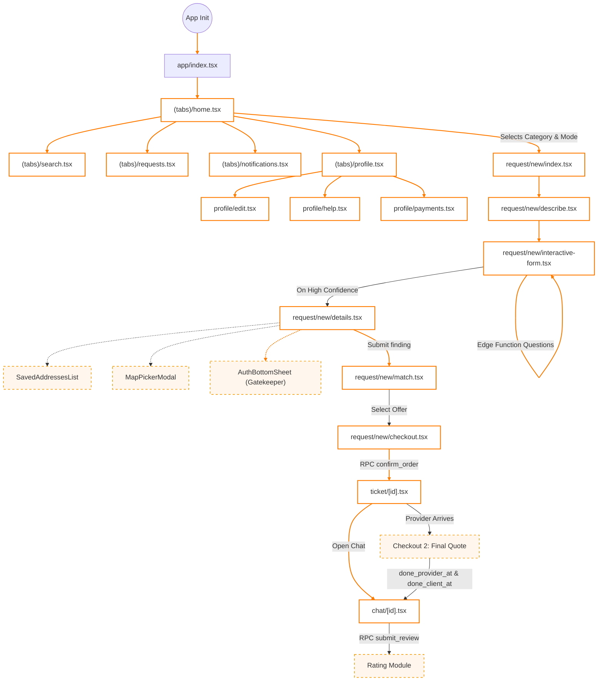
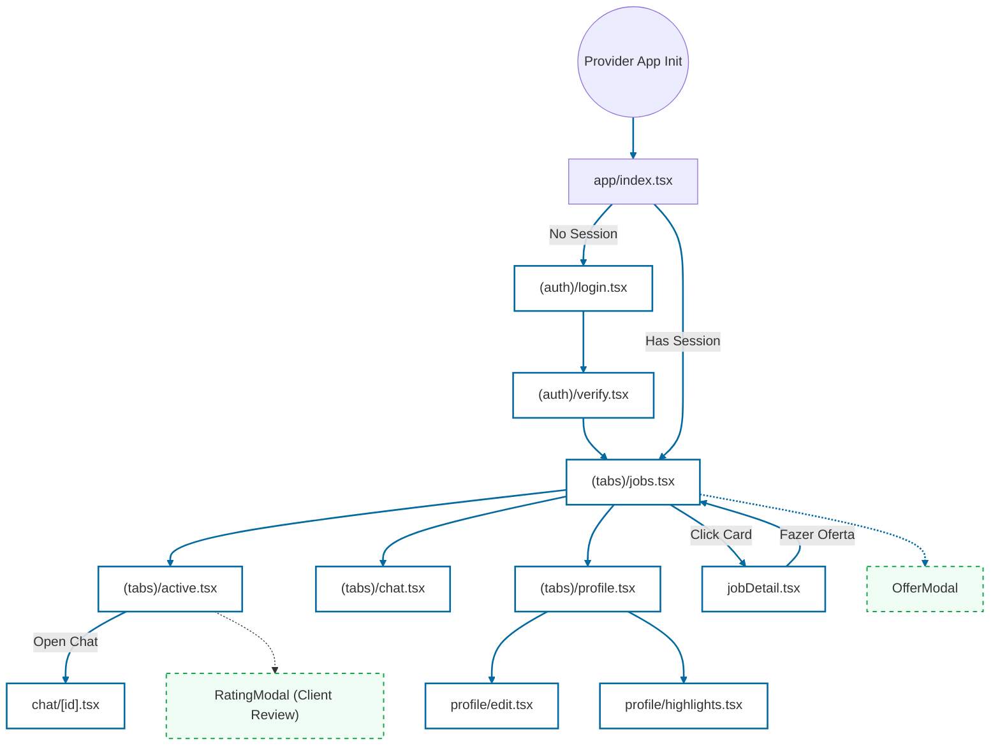
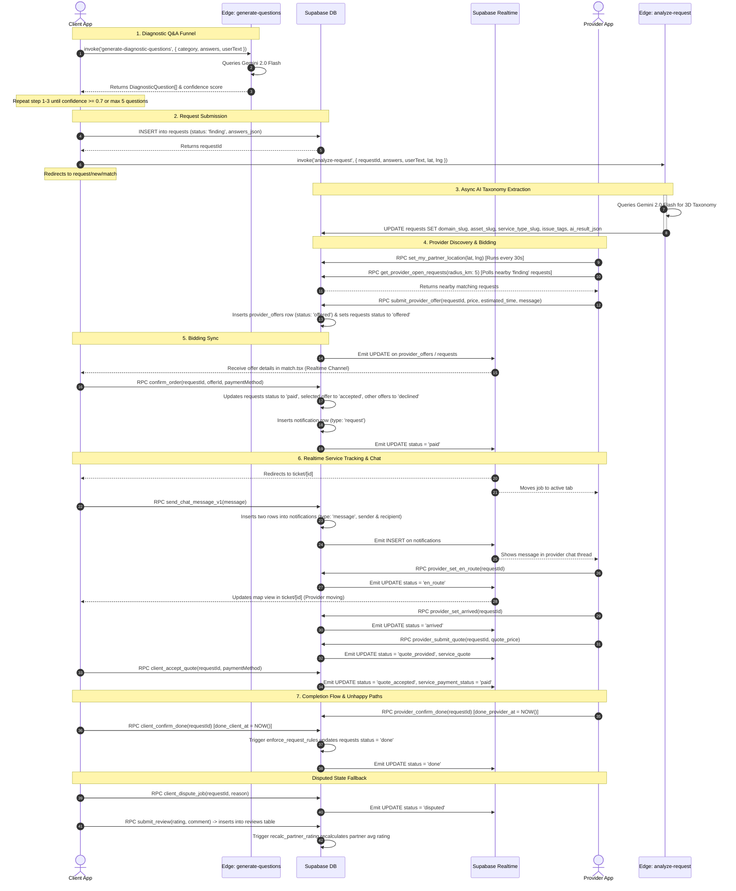

# REPARAÍ Project Blueprint & Architecture Spec

REPARAÍ is a dual-app mobile ecosystem (Client App and Provider App) built on **React Native / Expo Router** and powered by **Supabase** with **Gemini AI Edge Functions** for dynamic diagnostics and 3D taxonomy matchmaking.

This document serves as the absolute source of truth for the codebase topography, state anatomy, and nervous system flow.

---

## 1. Topography (The Skeleton)

The repository is structured as a monorepo-style setup containing three distinct workspace directories:
- **`client-app/`**: Expo React Native application for consumers.
- **`provider-app/`**: Expo React Native application for service providers.
- **`supabase/`**: Supabase migrations, configurations, and Deno Edge Functions.

### Directory Mapping & Presentation Layer Files

```
REPARAÍ/
├── client-app/                  # Client Expo App
│   ├── assets/                  # Shared image and font assets
│   └── src/
│       ├── app/                 # Expo Router Navigation Layer
│       │   ├── (tabs)/          # Main Tab Navigator
│       │   │   ├── _layout.tsx
│       │   │   ├── home.tsx     # Client Dashboard (Category selection & Mode selection)
│       │   │   ├── search.tsx   # Provider / Service manual search
│       │   │   ├── requests.tsx # Active and past request tickets
│       │   │   ├── notifications.tsx # Client notification center
│       │   │   └── profile.tsx  # Profile settings, Saved addresses, Payment methods
│       │   ├── profile/         # Profile sub-routes
│       │   │   ├── edit.tsx     # Client profile editor
│       │   │   ├── help.tsx     # Help center & customer support
│       │   │   └── payments.tsx # Payment methods management
│       │   ├── provider/        # Provider display routes
│       │   │   ├── [id].tsx     # Provider public profile & highlights detail
│       │   │   └── highlight-checkout.tsx # Booking checkout directly from provider page
│       │   ├── request/new/     # Request/Order Creation Funnel
│       │   │   ├── index.tsx    # Category/Domain select screen
│       │   │   ├── describe.tsx # Problem description editor (Photo/Audio attachment)
│       │   │   ├── interactive-form.tsx # Dynamic AI diagnostic question funnel
│       │   │   ├── details.tsx  # Location checkout (Saved addresses, CEP search, map picker)
│       │   │   ├── match.tsx    # Live pulsing radar & matchmaking bidding screen
│       │   │   └── checkout.tsx # Displacement fee checkout & payment method selector
│       │   ├── ticket/
│       │   │   └── [id].tsx     # Ticket Tracking screen (Live provider tracking map)
│       │   ├── chat/
│       │   │   └── [id].tsx     # Chat Thread with Provider (In-app messaging, reviews)
│       │   ├── index.tsx        # App entry point, redirects to /(tabs)/home
│       │   ├── _layout.tsx      # Main Router root layout
│       │   └── modal.tsx        # General purpose bottom sheets
│       ├── components/          # Reusable UI Components
│       │   ├── modals/          # Modal sheets (Auth, Filter, MapPicker)
│       │   ├── ui/              # Atom level design components (Buttons, Cards, GlassView)
│       │   └── ...
│       ├── context/             # Global Context State (Auth, Location, Request)
│       ├── hooks/               # Custom React Hooks
│       └── services/            # Supabase API services (aiService, chatService)
│
├── provider-app/                # Provider Expo App
│   └── src/
│       ├── app/                 # Expo Router Navigation Layer
│       │   ├── (auth)/          # Authentication flow
│       │   │   ├── _layout.tsx
│       │   │   ├── login.tsx    # OTP login entry
│       │   │   └── verify.tsx   # OTP code verification
│       │   ├── (tabs)/          # Main Tab Navigator
│       │   │   ├── _layout.tsx
│       │   │   ├── jobs.tsx     # Main feed of open requests (online switch)
│       │   │   ├── active.tsx   # Active, completed, and canceled service tracking
│       │   │   ├── chat.tsx     # Chat rooms inbox
│       │   │   └── profile.tsx  # Provider settings and metadata
│       │   ├── auth/
│       │   │   └── callback.tsx # Deep link callback handler
│       │   ├── chat/
│       │   │   └── [id].tsx     # Chat Thread with Client (Icebreaker chips)
│       │   ├── profile/
│       │   │   ├── edit.tsx     # Detailed provider profile and rate settings
│       │   │   └── highlights.tsx # Highlight portfolio and specializations configuration
│       │   ├── jobDetail.tsx    # Detailed page for an open request before bidding
│       │   ├── index.tsx        # Entry point redirect (redirects to jobs or login)
│       │   └── _layout.tsx      # Root Router layout
│       ├── context/             # Global contexts (Auth, Notifications)
│       └── hooks/               # Custom React Hooks (useOpenRequests, useProviderServices)
│
└── supabase/                    # Supabase Backend
    ├── functions/               # Deno Edge Functions
    │   ├── analyze-request/     # Async request analysis (Gemini 2.0 Flash)
    │   └── generate-diagnostic-questions/ # Dynamic Q&A generator (Gemini 2.0 Flash)
    └── migrations/              # Database schema migrations
```

---

## 2. Anatomy (Logic, State & UI)

Every screen is connected to specific data streams, global/local state, and styling patterns.

### A. Presentation & Logic Layer Breakdown

#### 1. Client App Funnel & Screens

| File Path | Data Layer (Supabase / APIs) | State Managed | Styling & UI |
| :--- | :--- | :--- | :--- |
| **`home.tsx`** | None (Static domains feed). | `useRequest` (Start draft), `useLocation` (Coordinates). | Apple-style card grids, horizontal banners, quick-start action buttons. |
| **`interactive-form.tsx`** | Invokes Edge Function `generate-diagnostic-questions` using `aiService`. | `funnelAnswers` (Object), `questionsHistory` (Array), `finalConfidence` (Number). | Progress bar, skeleton placeholders with pulsing animations, option cards. |
| **`details.tsx`** | Reads `saved_addresses` table, queries Correios CEP API via `cepService`. Invokes `submitRequest()` which calls `analyze-request` Edge Function asynchronously. | `description` (Local), `addressDetails` (Local), `LocationContext` (Selected location/CEP validation). | Floating bottom details panel, map layout, input textareas, horizontal saved address chips. |
| **`match.tsx`** | Subscribes to Realtime updates on `provider_offers` table. Polls `partners` table for active geolocation coordinates. | `status` ('finding' \| 'offered'), `assignedProvider` (Provider profile), `offerCandidates` (Bids). | Fullscreen `react-native-maps`, custom map style, radar pulsing animation ring, sliding offer bottom sheet. |
| **`checkout.tsx`** | Invokes RPC function `confirm_order`. | `selectedPayment` ('credit_card' \| 'pix' \| 'cash'). | Structured invoice breakdown, custom radio buttons for payment methods. |
| **`ticket/[id].tsx`** | Subscribes to Realtime updates on `requests` table. Polls and tracks partner displacement from `partners`. Invokes RPC `client_confirm_done`. | `ticket` (Detail data), `provider` (Tracking data), `ratingVisible` (Local modal toggle). | Fullscreen map with OSRM routing dashed-line path, success modal overlay, completion action banners. |
| **`chat/[id].tsx`** | Invokes RPC `send_chat_message_v1`. Inserts reviews via RPC `submit_review`. Subscribes to messages (`type = 'message'` in `notifications` table). | `messages` (Array), `inputText` (String), `reviewRating` (Number), `reviewComment` (String). | Clean messaging bubble log (incoming vs outgoing), timeline status tracker, inline review submission cards. |

#### 2. Provider App Screens

| File Path | Data Layer (Supabase / APIs) | State Managed | Styling & UI |
| :--- | :--- | :--- | :--- |
| **`jobs.tsx`** | Invokes RPC `get_provider_open_requests` inside 5km. Sets online readiness and updates GPS coordinates every 30s via RPC `set_my_partner_location`. Invokes RPC `submit_provider_offer` to bid and `reject_provider_offer` to mute. | `isOnline` (Switch), `requests` (Open requests list), `selectedOfferRequest` (Draft offer). | Linear gradient header dashboard, online switch toggle, floating offer form modal. |
| **`active.tsx`** | Loads active services using `useProviderServices` hook. Invokes RPC `provider_set_en_route` and RPC `provider_confirm_done`. Invokes RPC `submit_review`. | `filter` ('in_progress' \| 'done' \| 'canceled'). | Segmented control buttons, client profile summary cards, action trigger buttons. |
| **`chat/[id].tsx`** | Reads and sends messages using RPC `send_chat_message_v1` (inserts into `notifications` table). | `messages` (Array), `inputText` (String). | Safety banner, suggestion chip blocks (icebreakers). |
| **`profile/edit.tsx`** | Updates profile columns in `partners` table. | Profile details local form. | Simple forms, category selector, fixed vs mobile type picker. |

### B. Supabase Database Schema Spec

The database uses PostgreSQL schema objects with Row Level Security (RLS) enabled on all tables.



---

## 3. The Nervous System (Connections & Flow)

The integration flow combines Expo Router client-side routing, Supabase Realtime synchronization, and transactional RPC handlers.

### A. Client App Navigation Flow



### B. Provider App Navigation Flow



### C. End-to-End Architecture Sequence & Data Lifecycle

The following sequence details how the frontend applications communicate with Supabase, Gemini Edge Functions, and how data syncs in Realtime.



---

## 4. Architectural Rules & Maintenance (The Blueprint Guarantee)

To maintain synchronization between the code documentation and codebase implementation, the following guidelines must be followed:

1. **No Out-of-App Communication**: The chat services (`chatService.ts` and `providerChatService.ts`) actively block off-platform links, email addresses, and phone numbers (`hasExternalContactSignal`) for safety. The blueprint must continue to document this gatekeeping behavior.
2. **Deterministic Matching**: The system depends on the 3D taxonomy (Domain, Asset, Service type) extracted by Gemini. Changing these fields requires upgrading the `requests` table schema and updating both the Edge Function instructions and this blueprint spec.
3. **Database Integrity**: Requests cannot skip statuses. Status progression is strictly validated by the database trigger `enforce_request_rules`. Any new client features introducing new states must modify this PG function first.
4. **Realtime Priority**: Notifications (`notifications` table) double as Chat messages (`type = 'message'`). Modifying the notification schema impacts the chat room history log and unread counts.
